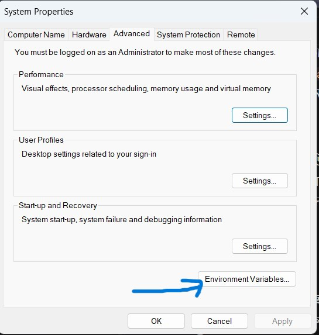
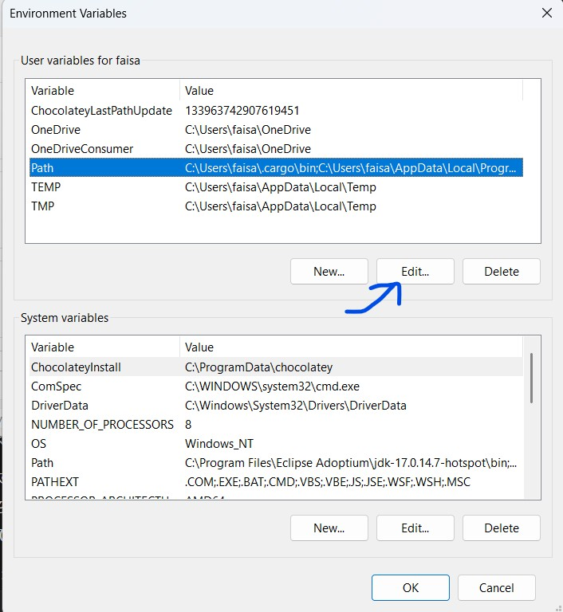
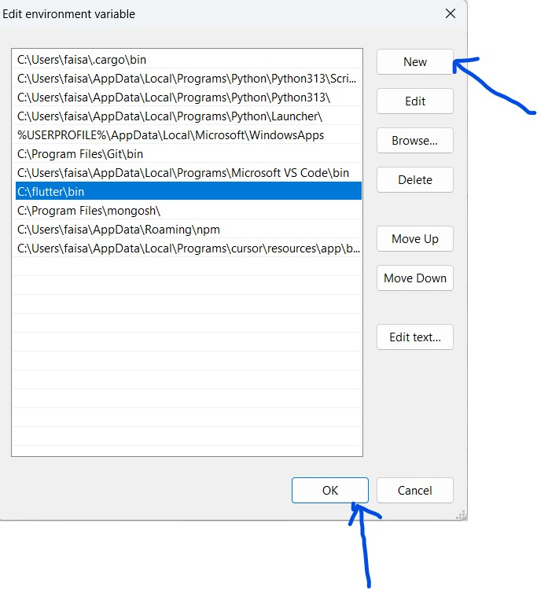
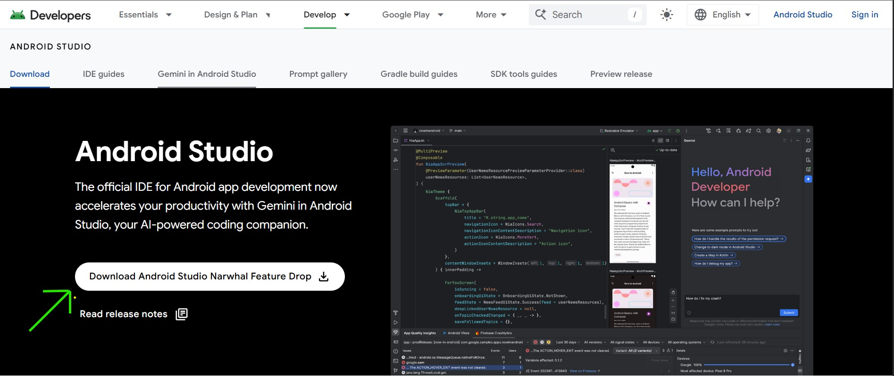
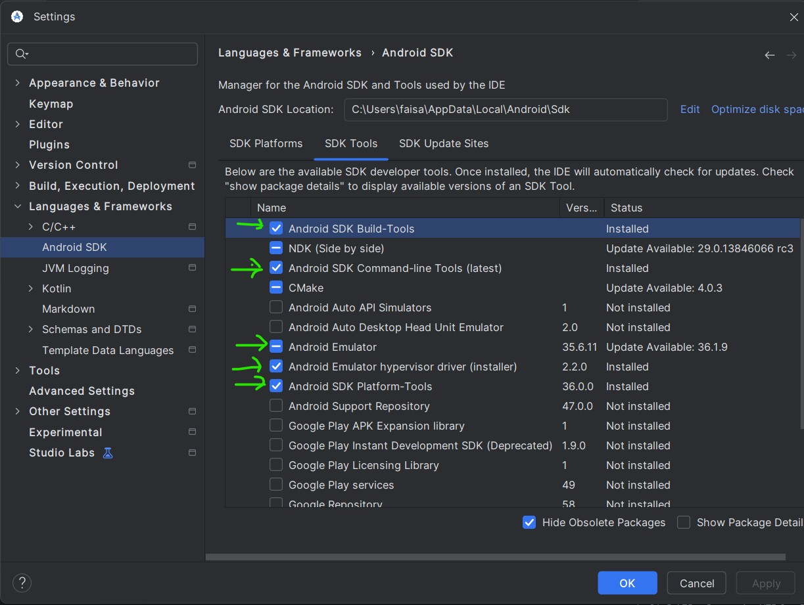
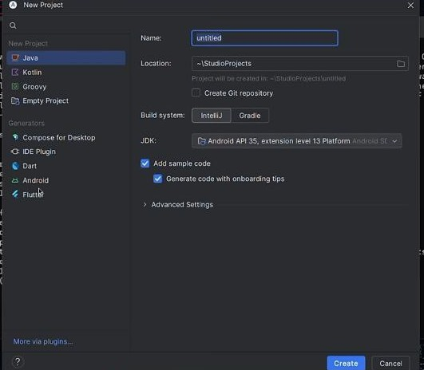
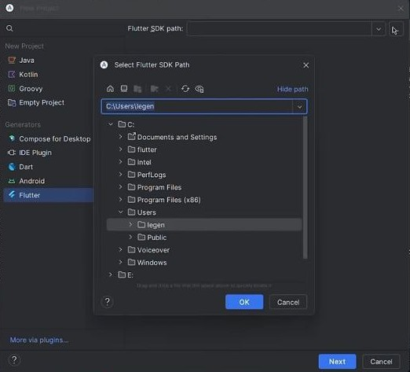
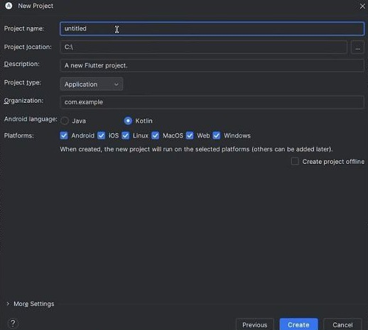

# Flutter Installation Guideline

# step_01: Install Flutter from flutter.dev website


Download Link : [Flutter sdk file ](https://docs.flutter.dev/get-started/install/windows/mobile)

এটা ইনস্টল হওয়ার পর extract করে তারপর c drive এ **C:\flutter\bin** path টা খুজে বের করে environment variable এর user variable er  **path** অপশন এ  set করবে 






<br><br>


# Step-2: Install Android Studio

Download Link: [Android Studio download](https://developer.android.com/studio)




### After installation android studio then ---

- Go android studio
- Then  File > Settings > Languages & Frameworks > Android sdk
- Then  sdk Tools
- Make sure install 
    - Android sdk-build tools 
    - Android sdk command line tools latest  
    - Android emulator 
    - android emulator hypervisor driver 
    - Android sdk platforms tools




### Then Go to android studio plugins option and type Flutter and install it.
### Then restart the android studio.


Then install virtual emulator.

<br><br>


RUN This command Commadnd prompt: 

```
flutter doctor

```


# Step-3: Android toolchain - develop for android device (android sdk version 35.0.0)

RUN This command in CMD : 

```
flutter doctor --android-licenses

```

then type all are   **y**


# step-4: Visual studio install

Download link: [Visual studio download ](https://visualstudio.microsoft.com/vs/preview/#download-preview)

go to the link and click visual studio community  **download preview**


# step-5: create a flutter project in android studio :




